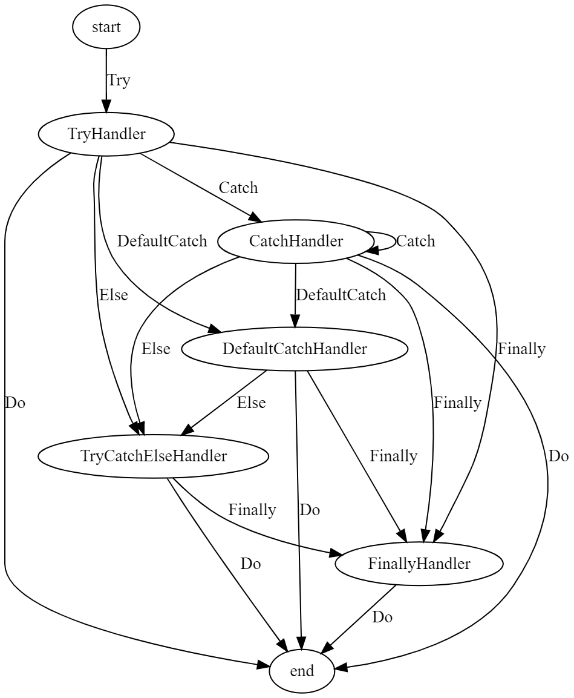

# Try-Catch的Go实现 

# 一、这是什么？为什么会有这个？

在其他语言中有try-catch的实现，但是在Go里面并没有提供try-catch的实现，更蛋疼的是Go里面很多操作又很容易panic，对panic的捕获很麻烦，粒度不好区分，因此就想着能不能引入一个库解决这个问题。 

当然这不是一个好的最佳实践，只是我们需要让业务能够正常跑起来更健壮以免隔三差五背锅，仅此而已！

最后，切记：错误应该被尽早的暴露出来，而不是一味的掩盖！

# 二、安装

```bash
go get -u github.com/golang-infrastructure/go-try-catch
```

# 三、Try-Catch方法 

提供了两种helper方法，一种是比较轻量级的方法，比如当有一段代码需要执行，但是不确定会不会产生错误，就可以这个样子： 

```go
package main

import (
	"errors"
	try_catch "github.com/golang-infrastructure/go-try-catch"
	"github.com/stretchr/testify/assert"
	"testing"
)

func TestTryCatch(t *testing.T) {

	var errFoo = errors.New("foo")

	// 正常执行
	err := try_catch.TryCatch(func() {
		t.Log("ok")
	})
	assert.Nil(t, err)

	// 执行时发生panic
	err = try_catch.TryCatch(func() {
		panic(errFoo)
	})
	assert.NotNil(t, err)
	assert.ErrorIs(t, err, errFoo)
}
```

如果需要返回值的话：

```go
func TestTryCatchReturn(t *testing.T) {

	var errFoo = errors.New("foo")

	// 正常执行
	v, err := try_catch.TryCatchReturn(func() int {
		return 10086
	})
	assert.Nil(t, err)
	assert.Equal(t, 10086, v)

	// 执行时发生panic
	v, err = try_catch.TryCatchReturn(func() int {
		panic(errFoo)
	})
	assert.NotNil(t, err)
	assert.ErrorIs(t, err, errFoo)
}
```

如果需要更多返回值：

```go
func TryCatchReturn2[R1, R2 any](f func() (R1, R2)) (r1 R1, r2 R2, err error) 
func TryCatchReturn3[R1, R2, R3 any](f func() (R1, R2, R3)) (r1 R1, r2 R2, r3 R3, err error) 
```


# 四、Try-Catch方法链

try-catch方法链就是定义了一些节点表示异常处理流程中的不同阶段，然后每个节点绑定对应的动作向下一阶段转移，整个状态图大概是这个样子的，其中节点是Struct，边是方法：



Example：

```go
package example

import (
	"errors"
	"fmt"
	try_catch "github.com/golang-infrastructure/go-try-catch"
	"testing"
)

func Test(t *testing.T) {

	// 正常执行
	try_catch.Try(func() {
		fmt.Println("ok")
	}).Do()

	// try发生异常，走catch
	var errFoo = errors.New("")
	try_catch.Try(func() {
		panic(errFoo)
	}).Catch(errors.New("bar"), func(err error) {
		fmt.Println("bar")
	}).Catch(errFoo, func(err error) {
		fmt.Println("foo")
	}).Do()

	// try发生异常，走默认catch
	try_catch.Try(func() {
		panic(errors.New("test"))
	}).Catch(errors.New("bar"), func(err error) {
		fmt.Println("bar")
	}).Catch(errFoo, func(err error) {
		fmt.Println("foo")
	}).DefaultCatch(func(err error) {
		fmt.Println("other")
	}).Do()

	// try未发生异常走else
	try_catch.Try(func() {
		_ = 100 + 19
	}).DefaultCatch(func(err error) {
		fmt.Println("other")
	}).Else(func() {
		fmt.Println("else")
	}).Do()

	// try发生异常，并且走finally
	try_catch.Try(func() {
		panic(errors.New("test"))
	}).DefaultCatch(func(err error) {
		fmt.Println("other")
	}).Else(func() {
		fmt.Println("else")
	}).Finally(func() {
		fmt.Println("finally")
	}).Do()

	// try未发生异常，并且走finally
	try_catch.Try(func() {
		_ = 100 + 19
	}).DefaultCatch(func(err error) {
		fmt.Println("other")
	}).Finally(func() {
		fmt.Println("finally")
	}).Do()

}
```

